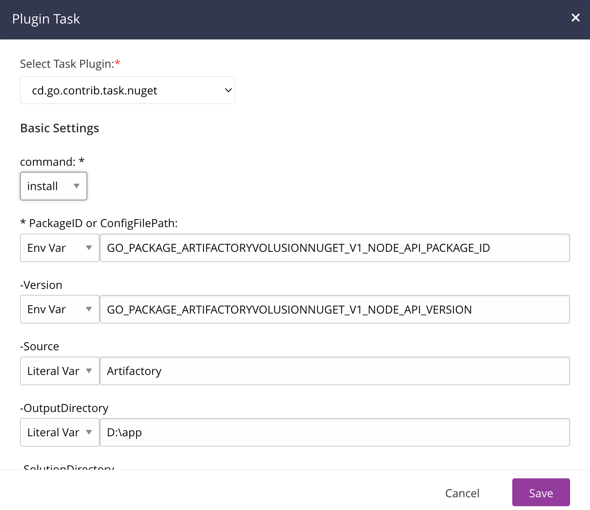

# GoCD NuGet Task Plugin

GoCD task plugin to run NuGet commands

## Prerequisites
GoCD Agents running this task must run on with NuGet installed. The `nuget` executable **MUST** be on the system path.

See [Installing nuget](https://learn.microsoft.com/en-us/nuget/reference/nuget-exe-cli-reference?tabs=macos#installing-nugetexe) for instructions on how to install NuGet.
